# ClassLogger AI (RAG Study Assistant)

ClassLogger is an academic ecosystem designed for engineering colleges. While the long-term goal of the project is to build an intelligent, natural-language queryable platform combining attendance intelligence, facial recognition, and performance analytics, the current version (V1) focuses on building a robust, metadata-aware Retrieval-Augmented Generation (RAG) study assistant.

This repository contains the RAG backend, document ingestion pipelines, and a developer-focused web chat interface.


---

## Features (Version 1)

*   **Multi-Format Ingestion:** Support for PDF notes (via PyMuPDF/fitz) and PowerPoint presentation slides (via Docling markdown conversion).
*   **Structured Question Paper Parsing:** Automated extraction of unstructured university question papers into structured JSON objects containing question numbers, subparts, marks, and mapping to Course Outcomes (CO) and Program Outcomes (PO).
*   **Metadata-Aware Vector Search:** Dynamic filtering of query context using AstraDB's native `$vectorize` feature.
*   **Hybrid Retrieval Routing:** Scans queries for keywords (like "exams", "questions", "pyq") to dynamically pull from both slide notes and structured previous year questions.
*   **Precise Web Chat Interface:** A developer-focused, single-column chat frontend built with vanilla HTML/CSS/JS, featuring a status notice panel, custom markdown rendering, loading/thinking animations, and detailed developer feedback.
*   **Processed File Tracking:** Maintains a state database (`processed.json`) to prevent duplicate document indexing and save vector database usage.

---

## System Architecture

```mermaid
graph TD
    %% Ingestion Pipeline
    subgraph Ingestion ["Ingestion Pipeline"]
        A[Academic Files: PDF/PPTX] --> B{File Type?}
        B -- PDF Notes --> C[PyMuPDF / Text Extraction]
        B -- PPTX Slides --> D[Docling / Markdown Conversion]
        B -- Question Papers --> E[Docling / Text Extraction]
        
        C --> F[Recursive Character Splitter]
        D --> G[Token-Aware Slide Splitter]
        E --> H[OpenRouter LLM Parser]
        
        H --> I[Structured JSON: CO, PO, Marks]
        F --> J[Metadata Generation: Subject, Unit]
        G --> J
        I --> J
        
        J --> K[(AstraDB Collection)]
    end

    %% Retrieval Pipeline
    subgraph Retrieval ["Retrieval & Answer Generation"]
        L[User Query] --> M{Query Router}
        M -- "Notes (Default)" --> N[Process notes search]
        M -- "Exams/PYQs Detected" --> O[Process notes + PYQ search]
        
        N --> P[AstraDB $vectorize Search]
        O --> P
        
        P --> Q[Context Compilation]
        Q --> R[OpenRouter LLM: qwen3-8b]
        R --> S[Web Chat Interface]
    end
```



---

## Project Structure

```
classloggerRAG/
├── .github/
│   └── workflows/
│       └── deploy-pages.yml   # GitHub Pages deployment workflow
├── data/
│   ├── NGD/                   # Next Generation Databases study material
│   ├── SEA/                   # Software Engineering & Architecture study material
│   ├── question papers/       # Unprocessed university question papers
│   └── processed.json         # State file tracking ingested documents
├── frontend/
│   ├── index.html             # Chat UI structural template
│   ├── style.css              # Custom styling sheet
│   └── chat.js                # Frontend state, rendering, and API fetch
├── ingest.py                  # Document chunking and AstraDB upload pipeline
├── main.py                    # RAG query processing and OpenRouter interface
├── server.py                  # Flask server serving frontend & wrapping main.py
├── vector.py                  # Legacy local database experiments (Ollama/Chroma)
└── requirements.txt           # Python dependency requirements
```

---

## Technical Stack

*   **Backend:** Python 3.10+, Flask
*   **Vector Database:** AstraDB (DataStax)
*   **Embeddings:** Hosted AstraDB `$vectorize` engine
*   **LLM Provider:** OpenRouter API (utilizing `qwen/qwen3-8b` by default)
*   **Document Processing:** PyMuPDF (`fitz`), Docling (`DocumentConverter`)
*   **Frontend:** Vanilla HTML5, CSS3, JavaScript (ES6)

---

## The RAG Pipeline

### 1. Ingestion Pipeline
The ingestion pipeline runs via `ingest.py` and processes files based on their location and type:
*   **PDF Notes:** Extracted using PyMuPDF, split into 350-token chunks with a 50-token overlap, tagged with subject and unit number, and pushed to AstraDB.
*   **PPTX Slides:** Extracted using Docling, converted to Markdown to preserve bulleted lists and tables, split using smaller 150-token chunks with a 25-token overlap to respect token limits, and uploaded.
*   **Question Papers:** Converted to plain text using Docling and sent to OpenRouter. An LLM parses the paper into a strict JSON schema containing all metadata (subparts, COs, POs, units, marks). Each question is then stored as an individual record of type `pyq`.

### 2. Retrieval Pipeline
When a query is received:
*   The system first retrieves reference note chunks.
*   The query is scanned for exam-related keywords. If found, a secondary query retrieves question paper records (`type: "pyq"`).
*   The combined context and query are packed into a prompt and evaluated by the LLM.

---

## Installation & Configuration

### Prerequisites
*   Python 3.10 or higher
*   An AstraDB database endpoint and API token
*   An OpenRouter API key

### 1. Clone the Repository
```bash
git clone https://github.com/your-username/classlogger-rag.git
cd classlogger-rag
```

### 2. Set Up Virtual Environment
```bash
python -m venv venv
# On Windows
.\venv\Scripts\activate
# On macOS/Linux
source venv/bin/activate
```

### 3. Install Dependencies
```bash
pip install -r requirements.txt
```

### 4. Configure Environment Variables
Create a `.env` file at the root of the project:
```env
ASTRADB_ENDPOINT="https://<your-db-id>-us-east1.apps.astra.datastax.com"
ASTRADB_API_KEY="AstraCS:..."
OPENROUTER_API_KEY="sk-or-v1-..."
```

---

## Running the Application

### Ingesting Data
To process new notes or question papers added to the `data/` directories:
```bash
python ingest.py
```

### Starting the Web Interface
Run the Flask server locally:
```bash
python server.py
```
Open your browser and navigate to `http://localhost:5000`.

---

## About the Development Process

This project is a hybrid development effort. It was **not** fully generated by AI. 

The software architecture, indexing design (such as opting for a single collection with metadata filtering rather than separate collections), ingestion logic, UI layouts, and overall debugging strategies were driven manually. AI was used actively as a development assistant—acting as a pair programmer for generating initial boilerplate, translating extraction ideas into code, discussing design trade-offs, and accelerating the creation of frontend styles.

---

## Challenges and Lessons Learned

### 1. The NVIDIA Embeddings Token Limit
During AstraDB vector ingestion, the system threw `Input length exceeds maximum allowed token size 512` errors. This occurs because the hosted NVIDIA embedding provider used by AstraDB enforces a strict 512-token ceiling. 
*   **Solution:** We introduced character-to-token translation utilizing `tiktoken` within the chunking loop, enforced a strict 350-token size limit for PDFs, and dropped it to 150 tokens for slides to prevent failures.

### 2. Tabular Document Structure Failures
Question papers contain complex table structures, grids, and page borders. Initially, we used Docling's `export_to_dict()` structure parser to parse the tables directly. However, merged headers, split questions across page breaks, and variable columns rendered rule-based parsers unstable.
*   **Solution:** We shifted to extracting raw text blocks and sending the text directly to an LLM with strict instruction guidelines. This dramatically improved reliability and successfully extracted mapping details like CO/PO targets and marks.

---

## Future Roadmap

The repository currently represents the baseline RAG system (V1). Future milestones include:

1.  **Hybrid Search:** Combining semantic vector search with keyword lexical matches (BM25) to retrieve exact formulas and questions.
2.  **Attendance Intelligence Integration:** Merging the RAG system with the existing ClassLogger face recognition and authorized WiFi attendance pipeline.
3.  **Academic Recommendation Engine:** Providing predictive advice to students on whether they can miss classes without dropping below the 75% attendance threshold.
4.  **Teacher Analytics Portal:** Natural language search over class performance records, trends, and weak topic clusters.

---

## License

This project is licensed under the MIT License - see the [LICENSE](LICENSE) file for details.
